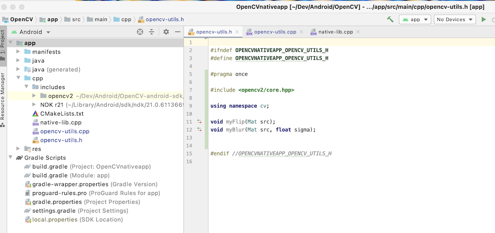
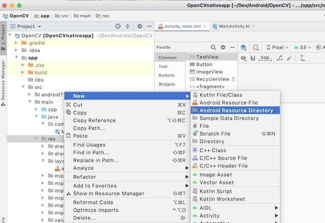
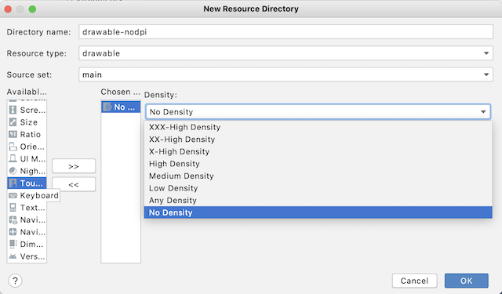

# **OpenCV Android Sample Project With Native App (C++ dev)**

## **First steps**

- How to create an **android native app** with **OpenCV** and **C++**

- Starting from a **Native C++** new project in **Android Studio 4.0.0** (28/05/2020)

- Example taken from :
  - https://youtu.be/Sn3YhfY5jqg
  - https://www.thecodingnotebook.com/2020/04/image-processing-with-opencv-in-android.html

- Needed to downgrade Android SDK Build tools from 33.0.2 to 29.0.2 to build the project

- Structure of the native app :

## **Add the CPP code**

- Add the .h and .cpp files where you have your own cpp code

- Change CMakeList.txt to add OpenCV-Android-SDK

- Now you should see opencv2 includes in the Android view of the project **You may have to close the project and open it to see it**

## **Build the GUI of our app in Java**

- After entering c++ code in opencv-utils.cpp and native-app.cpp  go to res => layout => activity_main.xml and remove "HelloWorld"

- Then go under project view and res => New Android Resources to create a new folder in **Res**

- For this select **drawable** in resource type, then select **density** with **no density** 

- Which adds a new folder **drawable-nodpi**

- Then :
  - drop an image in the **drawable-nodpi** folder
  - go to common => ImageView
  - drop the img on the layout
  - arrange the image size and position

  
## **Functions on Java side with MainActivity.kt**
- Import all the necessary packages :
  - android.graphics.Bitmap
  - android.graphics.BitmapFactory
  - android.view.View
  - android.widget.Seekbar
  - java.lang.Float.max

- Declares the new native (JNI) methods in MainActivity.kt

- Processing Android Bitmap

  - on Creation : load the image in srcBitmap and dstBitmap, set the imageView to dstBitmap as it will be updated

  

  - Add the methods applied when changes occur in the seekbar and the button 

  

  

## **Modifications on the APK generation**
- To avoid having the libs compiled for all architectures => use the **split** option  in **build.gradle**

  

- Build a **signed** APK in Release config => modifications in **build.gradle**

  
